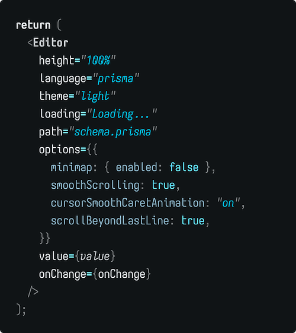

# Iosevka Solai

Solai is a custom build of [Iosevka](https://github.com/be5invis/iosevka) for
personal use. Mostly an extension of the "curvy" preset, with other variants
chosen as I see fit.

## Usage

In most cases you will want to fetch the tarball from the latest
[GitHub release](https://github.com/Ovyerus/iosevka-solai/releases) and manually
install from them.

If you use Nix with either [NixOS](https://nixos.org) or
[nix-darwin](https://github.com/LnL7/nix-darwin), this repository is available
to use as a flake.

### Nix: Preventing building from source

Due to the nature of Iosevka's build process, being very resource intensive, you
probably don't wish to build it from source. In that case, this flake provides a
`bin` package which skips the build process and instead will fetch the pre-built
font from the
[latest GitHub release](https://github.com/Ovyerus/iosevka-solai/releases/latest)
and extract it for you.

However, if you wish to avoid fetching data from a GitHub release for whatever
but still do not wish to build it from source if possible, I have set up a
[Cachix](https://cachix.org) cache to provide binaries for this. Simply install
the Cachix CLI and then run `cachix use ovyerus`, and it _should_ pull the font
files from there instead of running the build locally.

If you decide to skip out on using the GitHub derivation, using Cachix or not,
make sure to replace the `iosevka-solai.packages.${system}.bin` expressions in
the following examples to instead use
`iosevka-solai.packages.${system}.default`.

> [!NOTE]  
> Since this flake does not closely follow the latest upstream `nixpkgs`
> version, if you wish to pull the font from Cachix you will need to make sure
> that you **do not** set `inputs.iosevka-solai.nixpkgs.follows` to your nixpkgs
> version, as then there is a chance that something will have changed and you
> won't be able to fetch the font from the cache.

### NixOS

```nix
{
  inputs = {
    # Whatever channel your system is already using.
    nixpkgs.url = "github:NixOS/nixpkgs/nixpkgs-unstable";

    iosevka-solai = {
      url = "github:Ovyerus/iosevka-solai";
      inputs.nixpkgs.follows = "nixpkgs";
    };
  };

  outputs = {
    nixpkgs,
    iosevka-solai,
    ...
  }: {
    nixosConfigurations."hostname" = nixpkgs.lib.nixosSystem {
      system = "...";
      modules = [
        ({...}: {
          # 23.05 and below
          fonts.fonts = [iosevka-solai.packages.${system}.bin];
          # 23.11 and above
          fonts.packages = [iosevka-solai.packages.${system}.bin];
        })
      ];
    };
  };
}
```

### nix-darwin

```nix
{
  inputs = {
    # Whatever channel your system is already using.
    nixpkgs.url = "github:NixOS/nixpkgs/nixpkgs-unstable";

    nix-darwin = {
      url = "github:LnL7/nix-darwin";
      inputs.nixpkgs.follows = "nixpkgs";
    };

    iosevka-solai = {
      url = "github:Ovyerus/iosevka-solai";
      inputs.nixpkgs.follows = "nixpkgs";
    };
  };

  output = {
    nix-darwin,
    nixpkgs,
    iosevka-solai,
    ...
  }: {
    darwinConfigurations."hostname" = nix-darwin.lib.darwinSystem {
      modules = [
        ({...}: {
          fonts.fontDir.enable = true;
          fonts.fonts = [
            iosevka.packages.${system}.bin
          ];
        })
      ];
    };
  };
}
```



---

Iosevka is licensed under the
[SIL Open Font License 1.1](https://github.com/be5invis/Iosevka/blob/main/LICENSE.md).
The code in this repostiory is licensed under the [Zlib license](./LICENSE).
